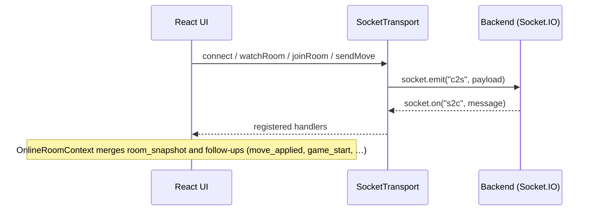

# Chess — Web Application

A browser-based chess application built with **React**, **TypeScript**, and **Vite**. It supports **local two-player** games on one device, **play against the computer** using **Stockfish 18** in a Web Worker (UCI), and **real-time online** play over **Socket.IO** when a compatible backend is running.

---

## Features

| Mode | Description |
|------|-------------|
| **Local** | Two humans share the same screen. Move validation and game state are handled entirely in the browser with **chess.js**. |
| **vs Computer** | You play one side. The app queries **Stockfish** (UCI) for a reply after each of your moves. |
| **Online** | Create or join a room by code. Moves go to the server, which owns the authoritative position. The client **replays** the move list from the server when the room version changes (reconnect-safe). |

Common UI elements across modes include move history, optional clocks, promotion picker, captured-piece strip, check highlighting, and game-over handling (checkmate, stalemate, draws, timeouts where applicable).

---

## Tech Stack

- **React 19** + **React Router 7**
- **TypeScript** + **Vite 8**
- **chess.js** — rules, FEN, SAN/LAN, move generation
- **Stockfish** (`stockfish` npm package) — engine in a **Web Worker**, UCI over `postMessage`
- **Socket.IO client** — online transport
- **Tailwind CSS 4** + **Radix UI** (dialogs)
- **Biome** — lint/format
- **Vitest** — unit tests

---

## Prerequisites

- **Node.js** (current LTS recommended)
- **npm** (or compatible package manager)

For **online** mode you also need the **companion backend** (see below).

---

## Quick Start

```bash
npm install
npm run dev
```

Open the URL Vite

### Production build

```bash
npm run build
npm run preview   # optional: test the production bundle locally
```

The build output directory is **`build/`** (configured in `vite.config.js`).

---

## Environment Variables

| Variable | Required | Purpose |
|----------|----------|---------|
| `VITE_ONLINE_SOCKET_URL` | **Yes** for online features | Full origin of the Socket.IO server, e.g. `http://localhost:3001` |

Define it in a **`.env`** or **`.env.local`** file in the project root (Vite convention). If it is missing, `SocketTransport` throws when constructed — the online section of the app will not work until it is set.

---

## Companion Backend (Online)

Online play is implemented against a **separate Node server** that speaks the same wire protocol as this client.

- Expected sibling path in the diploma layout: **`../chess-backend`** (not bundled in this repository).
- The server uses **Express + Socket.IO**, validates moves with **chess.js**, and emits messages on the **`s2c`** event. The client sends **`c2s`** payloads.
- Typical dev setup: run the backend (default port **3001** in its code) with CORS allowing **`http://localhost:5173`**, then set:

  ```env
  VITE_ONLINE_SOCKET_URL=http://localhost:3001
  ```

Refer to the backend’s `package.json` and entry (`src/index.ts`) for its start command, default port, and CORS settings.

---

## How the Application Works

### Routing

| Path | Page |
|------|------|
| `/` | Home — pick a mode |
| `/local` | Local two-player game |
| `/vs-computer` | Game vs Stockfish |
| `/online` | Online lobby |
| `/online/room/:roomId` | Room lobby — share code, guest joins, wait for start |
| `/online/play/:roomId` | Active online game |

Routes are defined in `src/routes.ts`.

### Game state and rules

All modes use **chess.js** `Chess` instances on the client for rendering, legality when you drag/click, and UI state (check square, side to move, etc.). **Online** additionally **re-synchronises** from the server’s move list via `replayMovesFromUci` whenever `room.v` changes, so the board always matches the server after reconnects or concurrent updates.

### Stockfish (vs Computer)

1. **Vite** copies Stockfish lite binaries into `public/stockfish/` on `build` and can serve them from `node_modules` in dev (`vite.config.js`).
2. **`StockfishClient`** (`src/engine/stockfishClient.ts`) loads `stockfish-18-lite-single.js` as a **Worker** and exchanges **UCI** lines (`uci`, `position`, `go`, …).
3. **`applyStockfishMove`** parses the bestmove line with the same **UCI parser** used elsewhere (`parseUci` in `src/utils/chess/uci.ts`).

### Online architecture (high level)



- **`OnlineRuntimeProvider`** creates a stable **`playerId`** (`localStorage`) and a **`SocketTransport`** singleton for the `/online` subtree.
- **`OnlineRoomContext`** subscribes to `s2c` messages, keeps the current **room snapshot** (version `v`, moves, players, clocks metadata), and exposes loading/error state to room and play pages.
- Moves are sent as **UCI** (from `move.lan` in chess.js) plus **SAN** and **ply index**, matching the backend contract.

### Source layout (overview)

| Area | Role |
|------|------|
| `src/components/` | Board, pages’ game shells, modals, layout |
| `src/constants/chess/` | Shared enums/constants (colours, game status, board files) |
| `src/types/chess/` | TypeScript types for chess UI and wire models |
| `src/utils/chess/` | Pure helpers — UCI parsing, square ordering, replay, captures grouping, check square, engine bridge pieces |
| `src/online/` | Socket transport, protocol types, room helpers, player id |
| `src/engine/` | Stockfish client, presets, applying engine moves |
| `src/hooks/` | Captured pieces, game status from chess, delayed game-over modal |
| `src/tests/` | Vitest specs (`chess/`, `online/`) |

---

## NPM Scripts

| Command | Description |
|---------|-------------|
| `npm run dev` | Start Vite dev server |
| `npm run build` | Production build → `build/` |
| `npm run preview` | Serve the production build locally |
| `npm test` | Run **Vitest** (watch mode by default. Use `npm test -- --run` for CI) |
| `npm run typecheck` | `tsc --noEmit` |
| `npm run check` | Biome lint + format check |
| `npm run lint` / `format` / `check:ci` | Biome subsets / CI mode |

---

## Testing

Tests live under **`src/tests/`**:

- Chess rules, UCI parsing, replay from UCI
- Board helpers, `gameStatusFromChess`, capture display grouping
- Online **protocol** helpers (`isRoomScopedServerMessage`, etc.)

Run once (non-interactive):

```bash
npm test -- --run
```

---

## Deployment Notes

- Configure **`VITE_ONLINE_SOCKET_URL`** for the **production** origin of your Socket.IO server (must be reachable from users’ browsers. Use `wss` / HTTPS in production as appropriate).
- Ensure the **Stockfish** worker and **`.wasm`** files are served under **`/stockfish/`** from the same origin as the app (the Vite build plugin copies them into `public/stockfish/`).
- If the app is hosted under a **subpath**, set Vite `base` accordingly so `StockfishClient` resolves the worker URL correctly (`import.meta.env.BASE_URL`).

---

## Licence

This project is **private** (see `package.json`).
